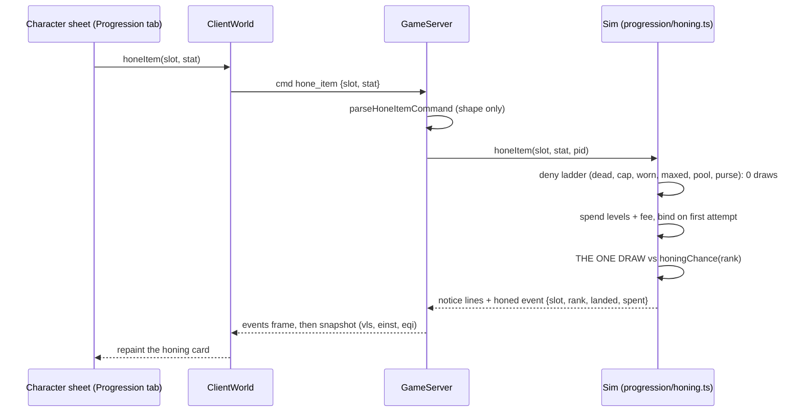

# Honing: virtual levels as an enchanting resource

| | |
|---|---|
| **Status** | Shipped |
| **Source demand** | Discord feature request: "Virtual lvls as an 'enchanting' resource" (virtual levels had no meaning; make them a spendable resource like Minecraft enchanting, with a Rift-style rising cost, a gold sink, and a Lineage-style glow on highly enchanted gear) |
| **Related systems** | Max-Level XP Overflow (`docs/prd/max-level-xp-overflow.md`), the Perfecting stage (`src/sim/professions/perfecting.ts`), the legendary regalia glow (`src/render/legendary_regalia_core.ts`) |

## Summary

Past the level cap a character keeps earning **virtual levels** off lifetime XP
(`virtualLevel` in `src/sim/types.ts`). Honing gives those levels a use: a worn piece of
gear can be honed one rank at a time, and every rank adds **+1 to one primary stat the
player chooses** (Strength, Agility, Stamina, Intellect, or Spirit). Each attempt burns
virtual levels and a gold fee and rolls once against a chance that falls with the rank
already on the piece. Highly honed gear glows.

The design intent is the request's own: a sink for players with nothing left to do, a
bragging surface, and a gold sink for the economy.

## The rules (one source: `src/sim/progression/honing_policy.ts`)

- **The pool.** Unspent virtual levels are `virtualLevel(lifetimeXp) - MAX_LEVEL -
  virtualLevelsSpent`. The ledger `virtualLevelsSpent` is persisted on the character; the
  displayed virtual level and the leaderboard stay pure functions of lifetime XP and never
  fall.
- **Cost.** Attempting rank `r + 1` on a piece at rank `r` burns `r + 1` virtual levels
  (1, 2, 3 ... 10; 55 for a full walk) and a quadratic fee of `50s * (r + 1)^2` (50s, 2g,
  4.5g ... 50g; 192.5g for a full walk).
- **Chance.** `max(0.2, 1 - 0.08 * r)`: the first rank always lands, the tenth sits at the
  floor.
- **Failure.** By default (option 2 of the request, the grindy shape) a failed roll spends
  the levels and the fee and leaves the piece as it was. `HONING_FAIL_RESETS` is the data
  knob for option 1 (a failed roll strips every rank); flipping the one literal changes
  the sim, the notice line, and the character-sheet hint together.
- **Cap.** `HONING_MAX_RANK = 10`.
- **Binding.** The first attempt binds the copy to the character (the Perfecting Maker's
  Bond reuse of `boundTo`), so honed gear never launders spent progression through the
  market or the mail.
- **Glow tiers.** Rank 4 shines, 7 brightens, 10 blazes (`HONING_GLOW_RANKS`).

## Where the state lives

- `PlayerMeta.virtualLevelsSpent` (persisted as `CharacterState.virtualLevelsSpent`,
  optional so pre-honing saves load at zero); the `vls` self scalar on the wire.
- `ItemInstancePayload.honing = { rank, stats }` on the worn copy: a SEPARATE additive
  channel that `activeItemInstanceStats` folds on top of `rolled.stats`, so combat,
  tooltips, compare, and auto-equip read it through the one existing projection while the
  Rift rebuild and the enchant replace-arm (both `rolled.stats` writers) never see it. The
  record joins the peer `eqi` allowlist and `publicInstanceView` (the glow and the inspect
  badge are the point); the bind never does.
- The load bound (`item_instance_load.ts`) keeps only the exact legal record shape
  (`isValidHoningRecord`), drop-only.

## Flow

## Surfaces

- **Character sheet, Progression tab:** the Honing card (`src/ui/honing_sheet_view.ts`
  pure core, `honing_sheet_controller.ts` listeners): the unspent pool, a worn-slot pick,
  a stat pick, the next rank's cost and chance, and the Hone button.
- **Item tooltip:** a "Honed +N" badge (`item_instance_tooltip.ts`); the +1s themselves
  render as ordinary per-copy bonus stat lines.
- **World:** the honed-gear shimmer (`src/render/honing_glow_core.ts`, `Vfx.honingGlow`),
  riding the legendary regalia shed exactly (static effects-tier gate, fixed distance
  anchor, reduced-motion suppression); see `docs/design/graphics-settings-fairness.md`.

## Tests

`tests/honing_policy.test.ts`, `tests/honing.test.ts`, `tests/honing_wire.test.ts`,
`tests/honing_sheet_view.test.ts`, `tests/honing_glow.test.ts`,
`tests/progression_commands.test.ts`.
