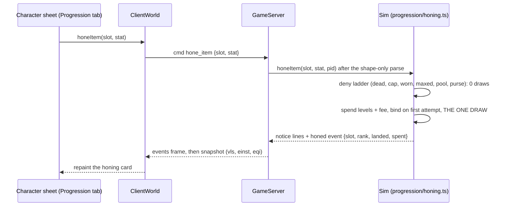

# Honing: virtual levels as an enchanting resource

| | |
|---|---|
| **Status** | Shipped |
| **Source demand** | Discord feature request "Virtual lvls as an 'enchanting' resource": virtual levels had no meaning; make them a spendable resource with a Rift-style rising cost, a gold sink, and a Lineage-style glow on highly enchanted gear |
| **Related systems** | Max-Level XP Overflow (`docs/prd/max-level-xp-overflow.md`), the Perfecting stage (`src/sim/professions/perfecting.ts`), the legendary regalia glow (`src/render/legendary_regalia_core.ts`) |

Past the level cap a character keeps earning virtual levels off lifetime XP. Honing spends
them: a worn piece is honed one rank at a time, each rank adding +1 to one primary stat the
player chooses. Every attempt burns virtual levels and a gold fee and rolls once against a
chance that falls with the rank already on the piece. Highly honed gear glows.

## The rules (one source: `src/sim/progression/honing_policy.ts`)

- **Pool:** `virtualLevel(lifetimeXp) - MAX_LEVEL - virtualLevelsSpent`. The ledger is
  persisted per character; the displayed virtual level and the leaderboard never fall.
- **Cost:** rank `r + 1` burns `r + 1` virtual levels (55 for a full walk) and
  `50s * (r + 1)^2` gold (192.5g for a full walk).
- **Chance:** `max(0.2, 1 - 0.08 * r)`; the first rank always lands.
- **Failure:** option 2 of the request: a miss spends the levels and fee and keeps the piece.
  Option 1 (a miss strips every rank) is a one-branch follow-up in `resolveHoningAttempt`.
- **Cap:** `HONING_MAX_RANK = 10`. **Binding:** the first attempt binds the copy (`boundTo`,
  the Perfecting reuse), so honed gear never launders spent progression through the market.
- **Glow tiers:** rank 4 shines, 7 brightens, 10 blazes (`HONING_GLOW_RANKS`).

## Where the state lives

- `PlayerMeta.virtualLevelsSpent` (`CharacterState.virtualLevelsSpent`, optional so old
  saves load at zero); the `vls` self scalar on the wire.
- `ItemInstancePayload.honing = { rank, stats }` on the copy: a separate additive channel
  `activeItemInstanceStats` folds on top of `rolled.stats`, so combat, tooltips, compare, and
  auto-equip read it through the one existing projection while the Rift rebuild and the
  enchant replace-arm never see it (the Rift load rebuild carries it explicitly). It joins
  the peer `eqi` allowlist and `publicInstanceView`; the bind never does. The load bound
  (`isValidHoningRecord`) is drop-only.

## Flow

## Surfaces and tests

The Honing card on the character sheet's Progression tab (`src/ui/honing_sheet_view.ts` +
`honing_sheet_controller.ts`), the "Honed +N" tooltip badge, and the honed-gear shimmer
(`src/render/honing_glow_core.ts`, `Vfx.honingGlow`, riding the legendary regalia shed; see
`docs/design/graphics-settings-fairness.md`). Tests: `tests/honing*.test.ts` and
`tests/progression_commands.test.ts`.
