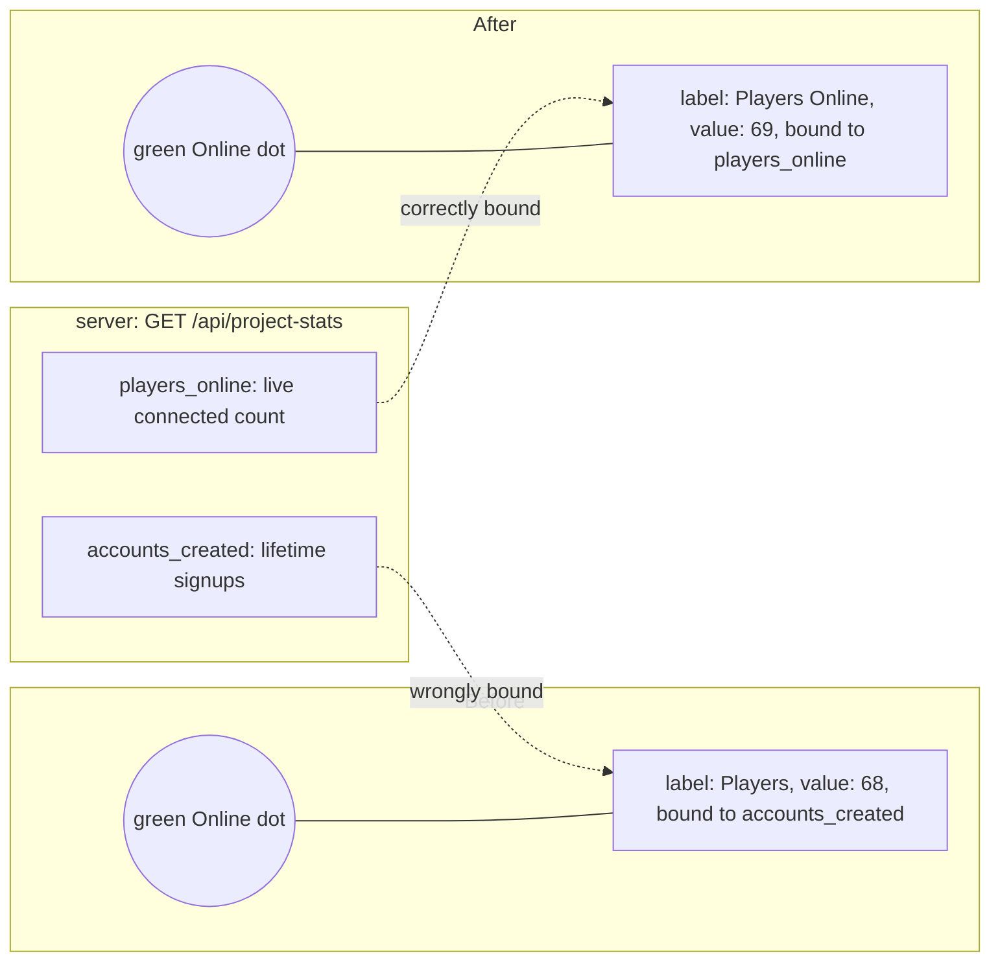

# Misleading "Players" stat next to the Online indicator

`before-landing-full.png` / `after-landing-full.png` (index.html realm selector) and
`before-play-full.png` / `after-play-full.png` (play.html online status line) show the
same landing-page stat before and after the fix, captured from the same dev build with
a live local server (small player counts are the local test environment; production
showed a much larger, equally misleading lifetime-accounts figure).

Root cause: `loadProjectStats()` in `src/main.ts` fetched both fields from the API but
rendered `.js-stat-accounts` (labeled "Players") from `accounts_created`, a lifetime
total of every account ever registered, right beside the green "Online" indicator. That
read as a live player count. `stats.playersOnline` ("Players Online") already existed,
fully translated, but was never wired up. Fix: rebind the element (renamed
`.js-stat-players-online`) to `players_online` and use the existing label.
