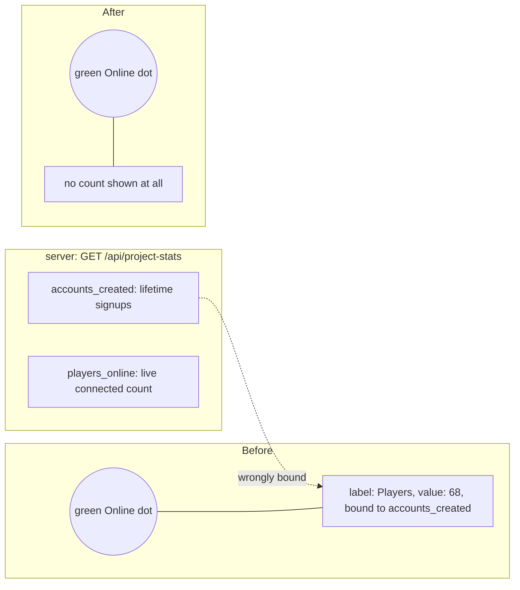

# Removed the misleading "Players" stat next to the Online indicator

`before-landing-full.png` / `after-landing-full.png` (index.html realm selector) and
`before-play-full.png` / `after-play-full.png` (play.html online status line) show the
same page before and after the fix, captured from the same dev build with a live local
server (small player counts in the "before" shot are the local test environment;
production showed a much larger, equally misleading lifetime-accounts figure).
`after-landing-dropdown.png` shows the opened realm dropdown: the "Online" option now
carries only its description text, no stat line.

Root cause: `loadProjectStats()` in `src/main.ts` rendered a "Players" figure from
`accounts_created`, a lifetime total of every account ever registered, right beside the
green "Online" indicator. That read as a live player count when it wasn't one. A first
pass rebound the element to the real `players_online` live count instead, but the
simpler, requested fix is to not show any player-count figure on these pages at all:
`loadProjectStats()`, its DOM hooks, and the now-dead CSS for them were removed
entirely, leaving just the plain "Online"/"Offline" status text that was already there.
