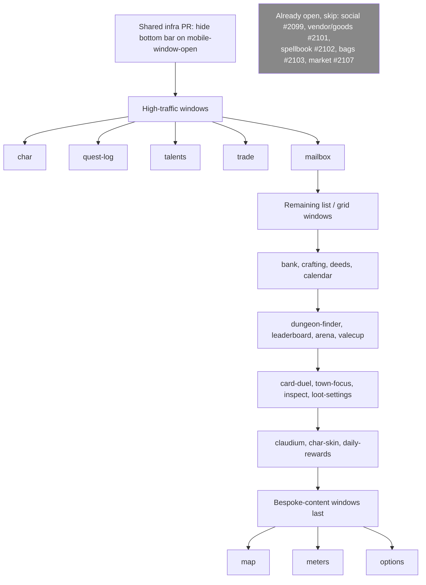

# Game window landscape relayout: design

**Status:** approved. **Base:** release/v0.28.0 (current tip of the release-branch chain).

## Goal

Every game window (~27 total) gets: (1) a landscape shape instead of tall/square, (2) its
repeating content reflowed into more columns / fewer rows to kill internal scrolling, (3)
components that fit-to-width instead of overflowing to a new row, (4) on mobile, near-100%
viewport height with the bottom action bar hidden while any window is open.

## Prior art (do not redo)

Five windows already have open PRs applying exactly this pattern against
`release/v0.28.0`: social (#2099), vendor/goods (#2101), spellbook (#2102), bags (#2103),
market (#2107). Skip these. Read `docs/screenshots/social-landscape-layout/` and PR #2099's
body as the reference recipe: widen the window, apply CSS multi-column (`columns:`) or grid
(`grid-template-columns: repeat(N, 1fr)`) to the row/tile container depending on content
shape, `column-span: all` / `grid-column: 1 / -1` for banner rows, and a mobile override
collapsing back to one column.

## Remaining windows (22), in execution order

char, quest-log, talents, trade, mailbox, bank, crafting, deeds, calendar,
dungeon-finder, leaderboard, arena, valecup, card-duel, town-focus, map, meters, inspect,
loot-settings, options, claudium, char-skin, daily-rewards.

(`dev-command-window` and `discord-window`/`report-window` are excluded: dev-only cheat UI
and small utility panels respectively, out of scope for this program.)

Order favors: highest player-facing traffic first (char, quest-log, talents, trade,
mailbox), then remaining list/grid windows, then bespoke-content windows (map, meters,
options) last since they need custom column groupings rather than the row-reflow recipe.

## Shared infra PR (goes first, unblocks nothing but should land early)

Add to `src/styles/hud.mobile.css`: `body.mobile-touch.mobile-window-open #bottom-bar {
display: none; }` (and its xpbar/resource companions if they render independently of
`#bottom-bar`). This is the "hide the bottom bar while a window is open" requirement for
every window at once, so it is one PR, not 22 copies. Verify against
`tests/mobile_window_layout.test.ts` / `tests/mobile_window_coverage.test.ts` and extend
their pins for the new rule.

## Per-window recipe (repeated 22 times, 1 PR each)

1. Own worktree/branch off `release/v0.28.0` (`feature/<window>-landscape-layout`).
2. Read the window's current CSS block (`src/styles/components.css` /
   `hud.mobile.css`) and its view/painter module. No DOM-building logic changes: this is
   a **layout-only** change, matching the #2099 precedent.
3. Widen the desktop rule to a landscape footprint (target `min(80vw, 1280px)` per
   `DESIGN.md` section 8.1 windows sizing where the window isn't already pinned to a
   fitted compact size).
4. Reflow the window's repeating content:
   - Row lists (friends/mail/bank-tabs/talent-list style) -> CSS `columns: <basis>px N`
     with `break-inside: avoid` per row, banners get `column-span: all`.
   - Tile/card grids (spellbook/talents-tree/deeds style) -> CSS grid
     `repeat(auto-fill, minmax(...))`.
   - Two-pane windows (list + detail, e.g. quest-log, char) -> side-by-side grid columns
     instead of a detail pane that used to sit below a scrolling list.
5. Fit-to-width: audit any component in the window that previously wrapped to a new row
   under overflow (buttons, filter chips, stat rows) and give it `flex-wrap` with
   `min-width: 0` / `flex: 1 1 auto` so it shares the row instead of wrapping. Cap every
   individual component's share of the window: no single row's element (a button group, a
   filter bar, a search input) may grow past roughly a third of the window's content width
   (`max-width: clamp(...)` or a fixed cap in the 220-320px range depending on the
   component, tuned per window rather than one global constant). Where a control cluster
   would otherwise need to exceed that cap to fit all its items (e.g. a button row with
   5+ actions, a tab strip with many tabs), collapse the overflow into a `<select>` or an
   overflow/kebab menu instead of letting the row widen or wrap to a second line. This
   applies on top of the multi-column reflow in step 4, not instead of it: reflow fixes
   the row/tile grid, this fixes any single oversized control sitting alongside it.
6. Mobile: confirm the window is in (or add it to) the shared near-fullscreen sheet block
   in `hud.mobile.css` (~line 2439) so it gets true near-100% height; only add a
   window-specific override where its real content needs one (matches the existing
   comment's exception pattern).
7. Tests: run the window's own unit/view tests, plus the shared guard suite already used
   by #2099 (`tests/mobile_window_coverage.test.ts`, `tests/mobile_window_layout.test.ts`,
   `tests/mobile_window_transform.test.ts`, `tests/css_value_validity.test.ts`,
   `tests/css_corpus.test.ts`, `tests/styles_extraction.test.ts`,
   `tests/architecture.test.ts`, `tests/pr_shot_targets.test.ts`), `npx tsc --noEmit`,
   biome on changed files.
8. Screenshots: capture before/after desktop + mobile via the `pr-screenshots` skill
   (following the #2099 precedent script pattern for windows needing populated state).
9. Mermaid diagram (before/after column layout) in the PR body, following #2099's format.
10. `gh pr create` against `release/v0.28.0`, PR template filled in, screenshots
    referenced.

## Execution model

Full loop: work through the 22 windows (plus the 1 shared infra PR) sequentially,
opening one PR per window, without pausing for review between each, except when
genuinely blocked (merge conflict against a moving release branch, red CI after
investigation, or a window whose "repeating content" shape is ambiguous enough that a
layout choice is a real design decision rather than a mechanical application of the
recipe above). Status is reported periodically (batches of a few PRs), not after every
single one, to avoid noise.

## Out of scope

- Any DOM-building / behavioral logic change in a window (bug fixes ride separately).
- Visual restyling beyond layout (colors, tokens, DESIGN.md phases 1-N) unless already
  required to make the new layout legible.
- The 5 windows with PRs already open.
- `dev-command-window`, `discord-window`, `report-window`.
